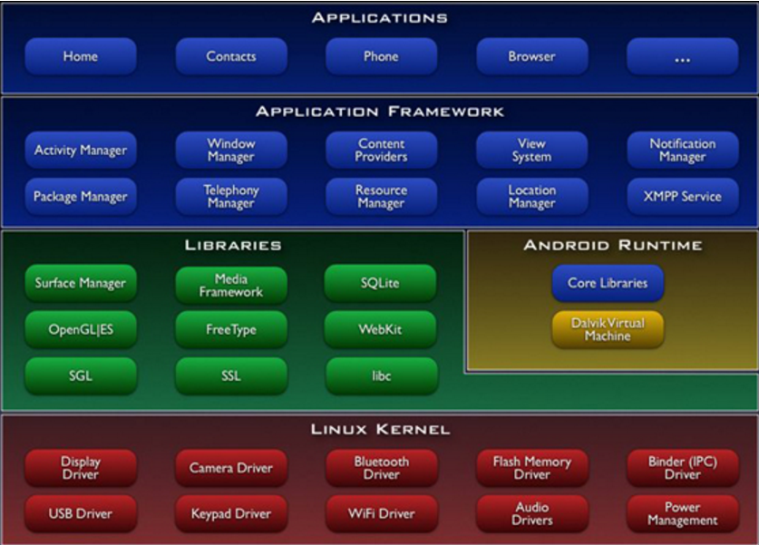

# 预备知识

## 1 通信技术

## 2 Android 起源
           Android一词的本义指“机器人”。Google于2007年11月5日宣布的基于Linux平台的开源手机操作系统的名称。该平台由操作系统、中间件、用户界面和应用软件组成。
　　Android是基于Linux内核的操作系统，是Google公司在2007年11月5日公布的手机操作系统。 早期由原名为"Android"的公司开发，谷歌在2005收购"Android.Inc"后，继续进行对Android系统开发运营，它采用了软件堆层的架构，主要分为三部分。
　　底层Linux内核只提供基本功能，其他的应用软件则由各公司自行开发，部分程序以Java编写。 2011年初数据显示，仅正式上市两年的操作系统Android已经超越称霸十年的塞班系统，使之跃居全球最受欢迎的智能手机平台。
　　现在，Android系统不但应用于智能手机，也在平板电脑市场急速扩张。

## 3 Android 体系架构
>Android的系统架构采用了分层架构的思想，从上层到底层共包括四层，分别是应用程序程序层、应用框架层、系统库和Android运行时和Linux内核。

 一 应用程序层

 该层提供一些核心应用程序包，例如电子邮件、短信、日历、地图、浏览器和联系人管理等。同时，开发者可以利用Java语言设计和编写属于自己的应用程序，而这些程序与那些核心应用程序彼此平等、友好共处。

二 应用程序框架层

  该层是Android应用开发的基础，开发人员大部分情况是在和她打交道。应用程序框架层包括活动管理器、窗口管理器、内容提供者、视图系统、包管理器、电话管理器、资源管理器、位置管理器、通知管理器和XMPP服务十个部分。在Android平台上，开发人员可以完全访问核心应用程序所使用的API框架。并且，任何一个应用程序都可以发布自身的功能模块，而其他应用程序则可以使用这些已发布的功能模块。基于这样的重用机制，用户就可以方便地替换平台本身的各种应用程序组件。

三 系统库和Android运行时

系统库包括九个子系统，分别是图层管理、媒体库、SQLite、OpenGLEState、FreeType、WebKit、SGL、SSL和libc。Android运行时包括核心库和Dalvik虚拟机，前者既兼容了大多数Java语言所需要调用的功能函数，又包括了Android的核心库，比如android.os、android.net、android.media等等。后者是一种基于寄存器的java虚拟机，Dalvik虚拟机主要是完成对生命周期的管理、堆栈的管理、线程的管理、安全和异常的管理以及垃圾回收等重要功能。

 四 Linux内核

  Android核心系统服务依赖于Linux2.6内核，如安全性、内存管理、进程管理、网络协议栈和驱动模型。Linux内核也是作为硬件与软件栈的抽象层。驱动：显示驱动、摄像头驱动、键盘驱动、WiFi驱动、Audio驱动、flash内存驱动、Binder（IPC）驱动、电源管理等。

  总结：

   1 Android的系统架构采用分层架构的思想，架构清晰，层次分明，协同工作。

   2. Android的系统架构不仅从宏观上认识了Android系统，同时，也给我们的学习与实践指明了方向。若是从事Android应用开发，那应该研究Android的应用框架层和应用程序层；若是从事Android系统开发，那应该研究Android的系统库和Android运行时；若是从事Android驱动开发，那应该研究Android的Linux内核。总之，找准切入点，实践出真知。
