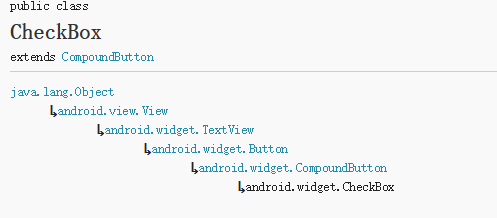
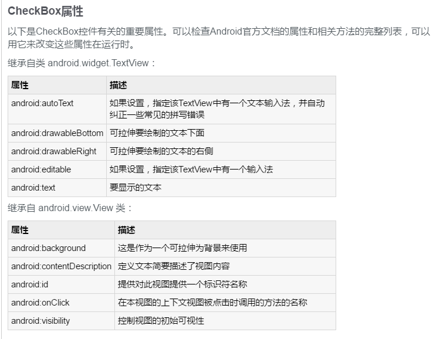
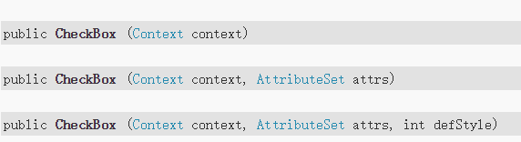

# checkbox的基本属性以及用法
CheckBox和Button一样，也是一种古老的控件，他的优点在于，不用用户去填写具体的信息，只需轻轻点击，缺点在于只有“是”和“否”两种情况，但我们往往利用它的这个特性，来获取用户的一些信息。
###ChcekBox的继承关系

###CheckBox的布局为：
<CheckBox
     android:id="@+id/cb"
     android:layout_width="wrap_content"
     android:layout_height="wrap_content"
     android:checked="false"
     android:text="已婚"></CheckBox>

###CheckBox布局的基本属性



###CheckBox的监听事件
```
//获取CheckBox实例
CheckBox cb = (CheckBox)this.findViewById(R.id.cb);
//绑定监听器
cb.setOnCheckedChangeListener(new OnCheckedChangeListener() {

            @Override
            public void onCheckedChanged(CompoundButton arg0, boolean arg1) {
                // TODO Auto-generated method stub
                Toast.makeText(MyActivity.this,
                        arg1?"选中了":"取消了选中"    , Toast.LENGTH_LONG).show();
            }
        });
```
###构造方法


###RadioButton和Checkbox组件使用方法的比较
RadioButton是**单选按钮**，多个RadioButton放在一个RadioGroup控件中，也就是说每次只能有1个RadioButton被选中。而CheckBox是**多选按钮**，Toatst是android中带的一个用于显示提示小窗口消息的控件，其提示的内容过一会儿会自动消失。
RadioGroup和CheckBox控件设置监听器都是用的setOnCheckedChangeListener函数，其输入参数是一个函数,且函数内部要实现1个内部类。RadioGroup监听器的输入参数用的是RadioGroup.OnCheckedChangeListener()
,而CheckBox监听器的输入参数用的是函数CompoundButton.OnCheckedChangeListener().
>效果图为


上面3个为一组RadioGroup，每选中其中一个RadioButton，则会有相应的提示。且只能选中其中的一个。
下面的4都为CheckBox，可以选中其中的多个。每个CheckBox被选中或者取消选中都有相应的文字提示小窗口。
###Java代码如下
```
package com.example.control1;
import android.app.Activity;
import android.os.Bundle;
import android.widget.CheckBox;
import android.widget.CompoundButton;
import android.widget.CompoundButton.OnCheckedChangeListener;
import android.widget.RadioButton;
import android.widget.RadioGroup;
import android.widget.TextView;
import android.widget.Toast;
public class MainActivity extends Activity {
    //定义各控件的变量
    private TextView who = null;
    private TextView how = null;
    private RadioGroup who_group = null;
    private RadioButton china = null;
    private RadioButton america = null;
    private RadioButton others = null;
    private CheckBox less = null;
    private CheckBox thirty = null;
    private CheckBox forty = null;
    private CheckBox fifty = null;
    @Override
    public void onCreate(Bundle savedInstanceState) {
        super.onCreate(savedInstanceState);
        setContentView(R.layout.activity_main);

        //获得对应的控件
        who = (TextView)findViewById(R.id.who);
        how = (TextView)findViewById(R.id.how);
        who_group = (RadioGroup)findViewById(R.id.who_group);
        china = (RadioButton)findViewById(R.id.china);
        america = (RadioButton)findViewById(R.id.america);
        others = (RadioButton)findViewById(R.id.others);
        less = (CheckBox)findViewById(R.id.less);
        thirty = (CheckBox)findViewById(R.id.thirty);
        forty = (CheckBox)findViewById(R.id.forty);
        fifty = (CheckBox)findViewById(R.id.fifty);

        //设置who_group的监听器，其实是一句代码，其参数是一个带有重构函数的对象
        who_group.setOnCheckedChangeListener(new RadioGroup.OnCheckedChangeListener() {

   public void onCheckedChanged(RadioGroup group, int checkedId) {
       // TODO Auto-generated method stub
       if(checkedId == china.getId()){
  Toast.makeText(MainActivity.this,"中国", Toast.LENGTH_SHORT).show();
       }
       else if(checkedId == america.getId()){
  Toast.makeText(MainActivity.this, "美国", Toast.LENGTH_SHORT).show();
       }
       else if(checkedId == others.getId()){
  Toast.makeText(MainActivity.this, "其它国家", Toast.LENGTH_SHORT).show();
       }
   }
        });

        //下面为4个checkbox多选按钮分别建立监听器
        less.setOnCheckedChangeListener(new OnCheckedChangeListener() {

   public void onCheckedChanged(CompoundButton buttonView, boolean isChecked) {
       // TODO Auto-generated method stub
       if(isChecked)
       {
  Toast.makeText(MainActivity.this, "30个以下", Toast.LENGTH_SHORT).show();
       }
       else{
  Toast.makeText(MainActivity.this, "不是30个以下", Toast.LENGTH_SHORT).show();
       }
   }
        });


      //下面为4个checkbox多选按钮分别建立监听器
        thirty.setOnCheckedChangeListener(new CompoundButton.OnCheckedChangeListener() {

   public void onCheckedChanged(CompoundButton buttonView, boolean isChecked) {
       // TODO Auto-generated method stub
       if(isChecked)
       {
  Toast.makeText(MainActivity.this, "30~39", Toast.LENGTH_SHORT).show();
       }
       else{
  Toast.makeText(MainActivity.this, "不是30~39", Toast.LENGTH_SHORT).show();
       }
   }
        });

      //下面为4个checkbox多选按钮分别建立监听器
        forty.setOnCheckedChangeListener(new OnCheckedChangeListener() {

   public void onCheckedChanged(CompoundButton buttonView, boolean isChecked) {
       // TODO Auto-generated method stub
       if(isChecked)
       {
  Toast.makeText(MainActivity.this, "40~49", Toast.LENGTH_SHORT).show();
       }
       else{
  Toast.makeText(MainActivity.this, "不是40~49", Toast.LENGTH_SHORT).show();
       }
   }
        });

      //下面为4个checkbox多选按钮分别建立监听器
        fifty.setOnCheckedChangeListener(new OnCheckedChangeListener() {

   public void onCheckedChanged(CompoundButton buttonView, boolean isChecked) {
       // TODO Auto-generated method stub
       if(isChecked)
       {
  Toast.makeText(MainActivity.this, "50以上", Toast.LENGTH_SHORT).show();
       }
       else{
  Toast.makeText(MainActivity.this, "不是50以上", Toast.LENGTH_SHORT).show();
       }
   }
        });


    }
}

```

###布局
```
<LinearLayout xmlns:android="http://schemas.android.com/apk/res/android"
    xmlns:tools="http://schemas.android.com/tools"
    android:layout_width="match_parent"
    android:layout_height="match_parent"
    android:orientation="vertical"
    >
    <TextView
        android:id="@+id/who"
        android:layout_width="wrap_content"
        android:layout_height="wrap_content"
        android:text="@string/who"
/>
<RadioGroup
        android:id="@+id/who_group"
        android:layout_width="wrap_content"
        android:layout_height="wrap_content"
        android:orientation="vertical"
      >
    <RadioButton
         android:id="@+id/china"
        android:layout_height="wrap_content"
        android:layout_width="wrap_content"
         android:text="@string/china"
  />
     <RadioButton
        android:id="@+id/america"
        android:layout_width="wrap_content"
        android:layout_height="wrap_content"
        android:text="@string/america"
  />
     <RadioButton
        android:id="@+id/others"
        android:layout_width="wrap_content"
        android:layout_height="wrap_content"
         android:text="@string/others"
  />
</RadioGroup>
       <TextView
            android:id="@+id/how"
            android:layout_width="wrap_content"
            android:layout_height="wrap_content"
            android:text="@string/how"
  />
        <CheckBox
            android:id="@+id/less"
            android:layout_width="wrap_content"
            android:layout_height="wrap_content"
            android:text="@string/less"
  />
       <CheckBox
            android:id="@+id/thirty"
            android:layout_width="wrap_content"
            android:layout_height="wrap_content"
            android:text="@string/thirty"
  />
       <CheckBox
            android:id="@+id/forty"
            android:layout_width="wrap_content"
             android:layout_height="wrap_content"
             android:text="@string/forty"
  />
       <CheckBox
             android:id="@+id/fifty"
            android:layout_width="wrap_content"
            android:layout_height="wrap_content"
             android:text="@string/fifty"
  />
</LinearLayout>
```

