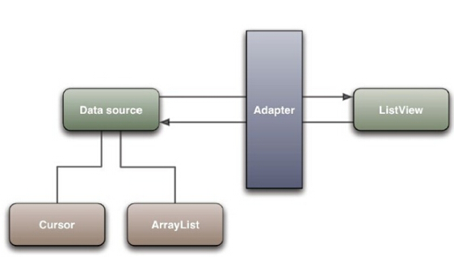
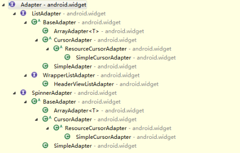

# Adapter概念

Adapter定义为将一个类的接口变换成客户端所期待的一种接口，从而使原本因接口不匹配而无法在一起工作的两个类能够在一起工作。 在android中我们可以这么看， Adapter是连接后端数据和前端显示的适配器接口，是数据和UI（View）之间一个重要的纽带。在常见的View(List View,Grid View)等地方都需要用到Adapter。

>如下图直观的表达了Data、Adapter、View三者的关系：

>Android中所有的Adapter一览：

由图可以看到在Android中与Adapter有关的所有接口、类的完整层级图。在我们使用过程中可以根据自己的需求实现接口或者继承类进行一定的扩展。比较常用的有 BaseAdapter，SimpleAdapter，ArrayAdapter。
+ BaseAdapter是一个抽象类，继承它需要实现较多的方法，所以也就具有较高的灵活性。
+ ArrayAdapter支持泛型操作，最为简单，只能展示一行字。
+ SimpleAdapter有最好的扩充性，可以自定义出各种效果。
+ SimpleCursorAdapter可以适用于简单的纯文字型ListView，它需要Cursor的字段和UI的id对应起来。如需要实现更复杂的UI也可以重写其他方法。可以认为是SimpleAdapter对数据库的简单结合，可以方便地把数据库的内容以列表的形式展示出来。
