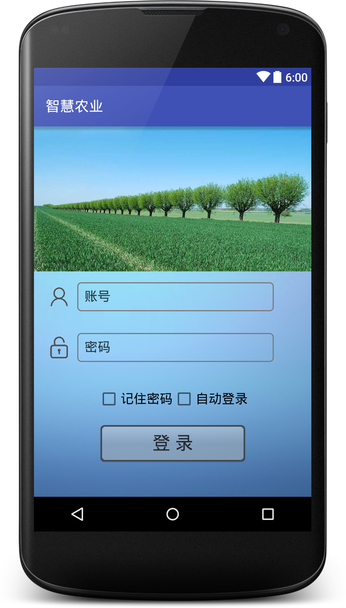

# 登录的一些代码
###布局文件
```xml
<?xml version="1.0" encoding="utf-8"?>
<LinearLayout xmlns:android="http://schemas.android.com/apk/res/android"
    xmlns:tools="http://schemas.android.com/tools"
    android:layout_width="match_parent"
    android:layout_height="match_parent"
    android:background="@mipmap/beijing"
    android:orientation="vertical"
    tools:context="com.fangshuoit.nongye.LoginActivity">

    <ImageView
        android:id="@+id/iv_login_image"
        android:layout_width="match_parent"
        android:layout_height="200dp"
        android:background="@mipmap/login_agricultural_background" />

    <LinearLayout
        android:layout_width="match_parent"
        android:layout_height="wrap_content"
        android:layout_margin="10dp">

        <ImageView
            android:layout_width="50dp"
            android:layout_height="50dp"
            android:padding="10dp"
            android:src="@mipmap/login_icon_user" />

        <EditText
            android:id="@+id/email"
            android:layout_width="272dp"
            android:layout_height="40dp"
            android:layout_gravity="center_vertical"
            android:background="@drawable/login_ed_shape"
            android:hint="账号"
            android:maxLines="1"
            android:singleLine="true"
            android:textColor="#000"
            android:textColorHint="#c0000000" />
    </LinearLayout>


    <LinearLayout
        android:layout_width="match_parent"
        android:layout_height="wrap_content"
        android:layout_margin="10dp">

        <ImageView
            android:layout_width="50dp"
            android:layout_height="50dp"
            android:padding="10dp"
            android:src="@mipmap/login_icon_password" />

        <EditText
            android:id="@+id/password"
            android:layout_width="272dp"
            android:layout_height="40dp"
            android:layout_gravity="center_vertical"
            android:background="@drawable/login_ed_shape"
            android:hint="密码"
            android:inputType="textPassword"
            android:maxLines="1"
            android:singleLine="true"
            android:textColor="#000"
            android:textColorHint="#c0000000" />
    </LinearLayout>

    <LinearLayout
        android:layout_width="match_parent"
        android:layout_height="wrap_content"
        android:layout_marginBottom="10dp"
        android:layout_marginTop="10dp"
        android:gravity="center"
        android:orientation="horizontal"
        android:padding="10dp">

        <CheckBox
            android:id="@+id/cb_pass"
            android:layout_width="wrap_content"
            android:layout_height="wrap_content"
            android:text="记住密码"
            android:textColor="#000"
            android:textSize="18sp" />

        <CheckBox
            android:id="@+id/cb_auto"
            android:layout_width="wrap_content"
            android:layout_height="wrap_content"
            android:text="自动登录"
            android:textColor="#000"
            android:textSize="18sp" />
    </LinearLayout>
    <Button
        android:id="@+id/btn_login"
        android:layout_width="wrap_content"
        android:layout_height="wrap_content"
        android:layout_gravity="center"
        android:background="@drawable/btn_selector"
        android:text="登 录"
        android:textColor="#c0000000"
        android:textSize="25sp" />


</LinearLayout>

```
###程序代码

``` Java
    package com.fangshuoit.nongye.activity;

    import android.app.ProgressDialog;
    import android.content.Intent;
    import android.content.SharedPreferences;
    import android.support.v7.app.AppCompatActivity;
    import android.os.Bundle;
    import android.view.View;
    import android.widget.Button;
    import android.widget.CheckBox;
    import android.widget.CompoundButton;
    import android.widget.EditText;
    import android.widget.Toast;

    import com.fangshuoit.nongye.R;
    import com.fangshuoit.nongye.application.SysConstants;
    import com.fangshuoit.nongye.utils.DebugLogUtil;
    import com.fangshuoit.nongye.utils.JSONUtil;
    import com.fangshuoit.nongye.utils.StringUtil;
    import com.fangshuoit.nongye.utils.ToastUtil;
    import com.zhy.http.okhttp.OkHttpUtils;
    import com.zhy.http.okhttp.callback.StringCallback;

    import okhttp3.Call;

    public class LoginActivity extends AppCompatActivity {

        private EditText mEmailView;
        private EditText mPasswordView;
        private CheckBox cbPass;
        private CheckBox cbAuto;
        private Button btnLogin;
        private SharedPreferences sp;
        private String name;
        private String pwd;

        @Override
        protected void onCreate(Bundle savedInstanceState) {
            super.onCreate(savedInstanceState);
            setContentView(R.layout.activity_login);

            initView();
            initEvent();
        }

        private void initView() {

            mEmailView = (EditText) findViewById(R.id.email);
            mPasswordView = (EditText) findViewById(R.id.password);
            btnLogin = (Button) findViewById(R.id.btn_login);
            cbPass = (CheckBox) findViewById(R.id.cb_pass);
            cbAuto = (CheckBox) findViewById(R.id.cb_auto);
            sp = getSharedPreferences("userInfo", MODE_PRIVATE);
        }

        private void initEvent() {

            btnLogin.setOnClickListener(new View.OnClickListener() {
                @Override
                public void onClick(View v) {

                    name = mEmailView.getText() + "";
                    pwd = mPasswordView.getText() + "";
                    DebugLogUtil.logd(name + pwd);
                    if (StringUtil.isEmpty(name)) {
                        ToastUtil.show(LoginActivity.this, "请输入账号！");
                    } else if (name.equals("")) {
                        ToastUtil.show(LoginActivity.this, "请输入账号！");
                    } else if (StringUtil.isEmpty(pwd)) {
                        ToastUtil.show(LoginActivity.this, "请输入密码！");
                    } else {
                        if (pwd.equals("")) {
                            mEmailView.setError("请输入密码！");
                        } else {
                            login(name, pwd);
                        }
                    }
                }
            });
            getSp();
        }

        //记录账户和密码信息
        private void getSp() {
            if (sp.getBoolean("ISCHECK", false)) {
                cbPass.setChecked(true);
                name = sp.getString("USER_NAME", "");
                pwd = sp.getString("PASSWORD", "");

                mEmailView.setText(name);
                mPasswordView.setText(pwd);
                if (sp.getBoolean("AUTO_ISCHECK", true)) {
                    cbAuto.setChecked(true);
                    if (StringUtil.isBlank(name) || StringUtil.isBlank(pwd)) {

                        ToastUtil.show(LoginActivity.this, "用户名或密码不正确！");

                    } else {
                        login(name, pwd);

                    }
                }
            }
            cbPass.setOnCheckedChangeListener(new CompoundButton.OnCheckedChangeListener() {
                @Override
                public void onCheckedChanged(CompoundButton buttonView, boolean isChecked) {
                    if (cbPass.isChecked()) {
                        DebugLogUtil.logd("记住密码被勾选！");
                        sp.edit().putBoolean("ISCHECK", true).commit();
                    } else {
                        DebugLogUtil.logd("记住密码没有被勾选！");
                        sp.edit().putBoolean("ISCHECK", false).commit();
                    }
                }
            });
            cbAuto.setOnCheckedChangeListener(new CompoundButton.OnCheckedChangeListener() {
                @Override
                public void onCheckedChanged(CompoundButton buttonView, boolean isChecked) {
                    if (cbAuto.isChecked()) {
                        DebugLogUtil.logd("自动登录已勾选！");
                        sp.edit().putBoolean("AUTO_ISCHECK", true).commit();
                    } else {
                        DebugLogUtil.logd("自动登录没有被勾选！");
                        sp.edit().putBoolean("AUTO_ISCHECK", false).commit();
                    }
                }
            });

        }

        //登录
        private void login(final String name, final String password) {

            final ProgressDialog progressDialog = ProgressDialog.show(LoginActivity.this, null, "正在加载...");

            String url = SysConstants.SERVER + SysConstants.APP_LOGIN;
            OkHttpUtils
                    .get()
                    .addParams("tempUser.loginName", name)
                    .addParams("tempUser.loginPassword", password)
                    .url(url)
                    .build()
                    .execute(new StringCallback() {
                                 @Override
                                 public void onError(Call call, Exception e) {
                                     Toast.makeText(getApplication(), "遇到网络错误！", Toast.LENGTH_SHORT).show();
                                     e.printStackTrace();
                                     if (progressDialog.isShowing()) {
                                         progressDialog.dismiss();
                                     }
                                 }

                                 @Override
                                 public void onResponse(String data) {
                                     String message = JSONUtil.getString(data, "message", "");
                                     String code = JSONUtil.getString(data, "code", "");
                                     String body = JSONUtil.getString(data, "body", "");
                                     String userId = JSONUtil.getString(body, "userId", "");


                                     if (code.equals("0")) {
                                         sp.edit().putString("USER_NAME", name).commit();
                                         sp.edit().putString("PASSWORD", password).commit();
                                         Toast.makeText(getApplication(), "登录成功！", Toast.LENGTH_SHORT).show();

                                         Intent intent = new Intent();
                                         intent.setClass(LoginActivity.this, MainActivity.class);
                                         intent.putExtra("tid", userId);
                                         startActivity(intent);
                                         finish();

                                         if (progressDialog.isShowing()) {
                                             progressDialog.dismiss();
                                         }
                                     } else {
                                         Toast.makeText(getApplication(), "登录失败，请检查用户名或密码！", Toast.LENGTH_SHORT).show();
                                         if (progressDialog.isShowing()) {
                                             progressDialog.dismiss();
                                         }
                                     }

                                 }
                             }

                    );
        }
    }

```

###界面效果


