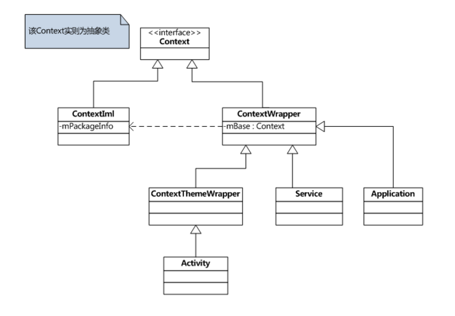

#第七课讲义


## 一、Context的理解与使用

> Context，中文直译为“上下文”，SDK中对其说明如下：

Interface to global information about an application environment. This is an abstract class whose implementation is provided by the Android system. It allows access to application-specific resources and classes, as well as up-calls for application-level operations such as launching activities, broadcasting and receiving intents, etc.

> 得知如下：

1.	它描述的是一个应用程序环境的信息，即上下文。
2.	该类是一个抽象(abstract class)类，Android提供了该抽象类的具体实现类。
3.	通过它我们可以获取应用程序的资源和类，也包括一些应用级别操作，例如：启动一个Activity，发送广播，接受Intent信息等。

####Context相关类的继承关系



>  Context类部分源码
```
    public abstract class Context {
         ...
         //获得系统级服务
         public abstract Object getSystemService(String name);
         //通过一个Intent启动Activity
         public abstract void startActivity(Intent intent);
         //启动Service
         public abstract ComponentName startService(Intent service);
         //根据文件名得到SharedPreferences对象
         public abstract SharedPreferences getSharedPreferences(String name,int mode);
         ...
    }
```

 > ContextIml.java类,说明：该Context类的实现类为ContextIml，该类实现了Context类的功能。

 ```
    class ContextImpl extends Context{
        //所有Application程序公用一个mPackageInfo对象
        /*package*/ ActivityThread.PackageInfo mPackageInfo;

        @Override
        public Object getSystemService(String name){
            ...
            else if (ACTIVITY_SERVICE.equals(name)) {
                return getActivityManager();
            }
            else if (INPUT_METHOD_SERVICE.equals(name)) {
                return InputMethodManager.getInstance(this);
            }
        }
        @Override
        public void startActivity(Intent intent) {
            ...
            //开始启动一个Activity
            mMainThread.getInstrumentation().execStartActivity(
                getOuterContext(), mMainThread.getApplicationThread(), null, null, intent, -1);
        }
    }
 ```

> ContextWrapper类,说明： 正如其名称一样，该类只是对Context类的一种包装，该类的构造函数包含了一个真正的Context引用，即ContextIml对象。

```
    public class ContextWrapper extends Context {
        Context mBase;
        //该属性指向一个ContextIml实例，一般在创建Application、Service、Activity时赋值

        //创建Application、Service、Activity，会调用该方法给mBase属性赋值
        protected void attachBaseContext(Context base) {
            if (mBase != null) {
                throw new IllegalStateException("Base context already set");
            }
            mBase = base;
        }
        @Override
        public void startActivity(Intent intent) {
            mBase.startActivity(intent);  //调用mBase实例方法
        }
    }
```
>  创建Context实例

1. 创建Application 对象时， 而且整个App共一个Application对象
2. 创建Service对象时
3. 创建Activity对象时

> 程序App共有的Context数目公式为：

 总Context实例个数 = Service个数 + Activity个数 + 1（Application对应的Context实例）

> 上下文应用理解举例

```java
    @android.view.RemotableViewMethod
        public final void setText(CharSequence text) {
            setText(text, mBufferType);
        }

    @android.view.RemotableViewMethod
    public final void setText(@StringRes int resid) {
        setText(getContext().getResources().getText(resid));
    }
    //以上两个方法为重载关系

    通过上下文对象获取资源文件
    package com.fangshuoit.androidstudy;

    import android.support.v7.app.AppCompatActivity;
    import android.os.Bundle;
    import android.widget.TextView;

    public class MainActivity extends AppCompatActivity {

        private TextView textView;

        @Override
        protected void onCreate(Bundle savedInstanceState) {
            super.onCreate(savedInstanceState);

            textView = new TextView(this);
            //设置文本显示框内容
            textView.setText("HELLO　ANDROID");
            //设置文本框显示内容
            textView.setText(R.string.hello_android);
            textView.setText(getResources().getText(R.string.hello_android));

            setContentView(textView);
        }
    }
```
